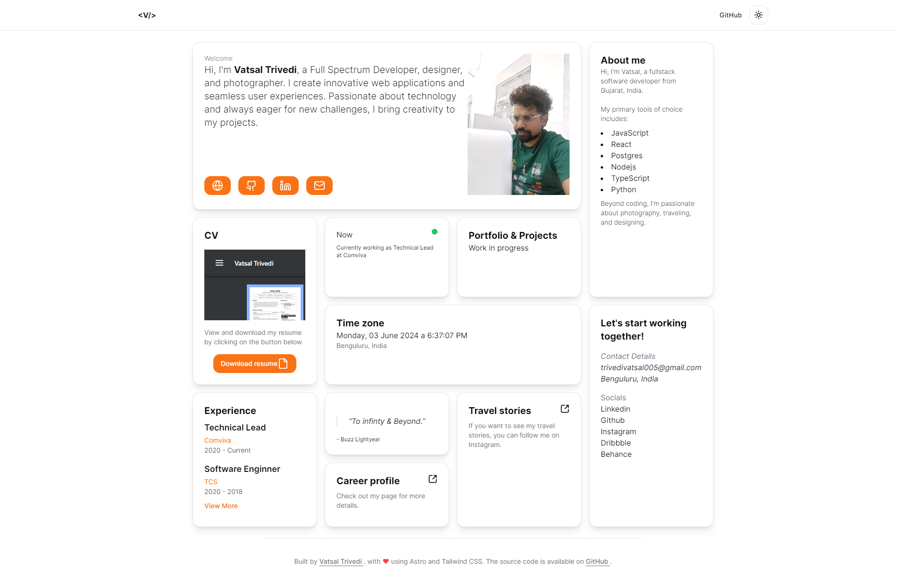

# Vatsal Trivedi - Portfolio  

This is my portfolio site built with the technologies mentioned below. The live URL is [https://vatsal.xyz](https://vatsal.xyz).

## Design



## Technologies Used

This project utilizes the following technologies:

- **Astro**: A modern framework for building fast and efficient websites.
- **Tailwind CSS**: A utility-first CSS framework for rapid and responsive design.
- **Shadcn UI**: A collection of accessible and easy-to-use UI components.
- **React**: For interactive components and advanced functionality.

## Requirements

Before starting, make sure you have the following requirements installed:

- Node.js (version 14 or higher)
- npm or yarn

## Installation

To install and run the project locally, follow these steps:

1. Install the dependencies:

   ```bash
   npm install
   # or
   yarn install
   ```

2. Start the development server:

   ```bash
   npm run dev
   # or
   yarn dev
   ```

3. Open your browser and visit `http://localhost:4321` to see your portfolio in action.

## Project Structure

A brief overview of the project structure:

- **/public**: Images and other static files.
- **/src**: Contains all Astro components and pages.
- **/styles**: Custom CSS files.
- **astro.config.mjs**: Main configuration for Astro.
- **tailwind.config.js**: Configuration for Tailwind CSS.

## Important Considerations

- **Accessibility**: Ensure your portfolio is accessible to all users, including those with disabilities.
- **SEO**: Optimize your portfolio for search engines by adding meta tags and relevant content.
- **Performance**: Use modern web development practices to ensure optimal performance, such as lazy loading images and minimizing CSS/JS.
- **Responsive Design**: Make sure your portfolio looks good on devices of all sizes, from mobile to desktop screens.

## Contributions

Contributions are welcome! If you have ideas or improvements, please open an issue or submit a pull request.

## License

This project is licensed under the [MIT License](LICENSE).

---

This template, originally developed by [bue221](https://github.com/bue221/astro-portfolio), has been tailored to reflect my experience.
Feel free to reach out with any questions or suggestions to improve this project!

---
