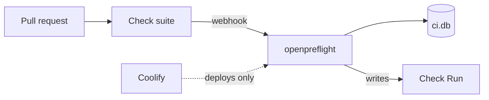

I keep private repos. I wanted a native GitHub Check Run on the pull request that says this commit built and the tests passed.

I didn't want a CI platform.

GitHub Actions would have done it. So would Woodpecker, Drone, a self-hosted `actions/runner`, or Jenkins. I've used all of those. They're reasonable answers. They also bring a control plane, a runner to register, a YAML dialect, or a bill I didn't want to think about for a handful of private repositories on a box I already pay for.

This is part 1 of 5 on building [openpreflight](https://openpreflight.xyz).

## Coolify already talked to GitHub. That wasn't enough.

I was already running Coolify on a Hetzner VPS. Deploys worked. Coolify's GitHub connector talks to GitHub just fine... for deploys. I assumed I could reuse that connector for commit checks and call it a day.

GitHub will not let you. Check Runs can only be created by a GitHub App. User tokens and OAuth tokens get refused. A GitHub App also has exactly one webhook URL. Coolify's connector webhook belongs to Coolify's deploy pipeline, and its manifest has no `checks` permission. Point it at a CI worker and you steal deploys. You don't add checks.

What I actually needed was a process that *is* the GitHub App. It receives the webhook, runs install / test / build on the exact commit, and writes one Check Run. Coolify can stay as inventory and a deploy target. It cannot author the Check Run.

The first repo was named `coolify-github-ci`. I renamed it to openpreflight because the name was lying. Coolify is optional here. The Check Run is the product.

## What I would not build

I wrote the out-of-scope list early, and I've kept it.

- No GitHub Actions YAML. It doesn't read `.github/workflows/`.
- No `actions/runner`.
- No matrices, caches, or artifacts.

That last one still surprises people. Publishing a release image is something this tool does not do, and it isn't on the roadmap. The project uses GitHub Actions for exactly one workflow: `release.yml`, on a `v*` tag. Everything else, including the Check Run on this repository, comes from a self-hosted instance at [ci.openpreflight.xyz](https://ci.openpreflight.xyz).

If you need stages, fan-out, or a forge that isn't GitHub, [Woodpecker](https://woodpecker-ci.org/) is the better default. I say so in the [comparison](https://docs.openpreflight.xyz/getting-started/comparison/). openpreflight is for when a check on the commit, on a box you already run, is the whole requirement.

## The shape that fell out

One Go binary, one SQLite file, one Check Run per commit.

The UI, the JSON API, the webhook receiver, and the job runner live in the same process. No message broker. No separate frontend. State is `$DATA_DIR/ci.db`. Secrets (the App PEM, the webhook secret, the Coolify token) are AES-256-GCM columns under `CI_SECRET_KEY`, which is the only environment variable you have to set.



```bash
curl -O https://raw.githubusercontent.com/openpreflight/openpreflight/main/compose.prod.yaml
export CI_SECRET_KEY="$(openssl rand -base64 48)"
docker compose -f compose.prod.yaml up -d
```

Open the UI, finish the wizard, register a GitHub App, enable a binding. The next `check_suite` on that repo is a Check Run with the full log behind it.

[Part 2](/blog/building-openpreflight-2-one-binary-one-sqlite-file/) is why I defend that shape instead of treating it as a starting point to grow out of.
