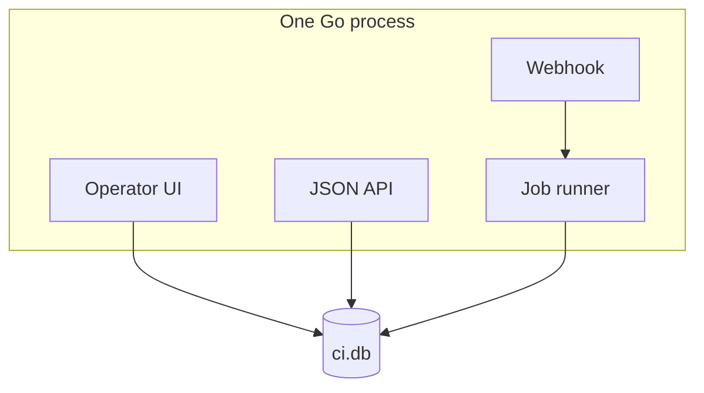

In [part 1](/blog/building-openpreflight-1-github-checks-without-a-ci-platform/) I said I wanted a Check Run, not a CI platform. The architecture is just that sentence with the obvious extras deleted: one Go process, one SQLite file, nothing else to schedule.

This is part 2 of 5. SQLite is the easy headline. I care more about everything that decision then forbade.

## A single replica, on purpose

openpreflight is one configurator and one worker in the same binary. A few jobs at a time. The Docker image stays `CGO_ENABLED=0`. There's no `pkg/` library and no plugin surface. Everything lives under `internal/`.

That's [ADR 001](https://docs.openpreflight.xyz/reference/decisions/001-database/). SQLite via `modernc.org/sqlite` (pure Go), file at `$DATA_DIR/ci.db`, WAL, `busy_timeout`, a single open connection. Schema changes are append-only migrations in `internal/store`.

What you don't get: Postgres or Redis to operate. Horizontal scale (`max_concurrent_jobs` is in-process, default 1). A stolen database that is automatically a full secret leak.

Secret columns (`pem_enc`, `webhook_secret_enc`, `api_token_enc`) are AES-256-GCM sealed under a key derived from `CI_SECRET_KEY`. Lose the volume and you re-enter Apps and tokens. Lose the key and the existing ciphertext is unreadable. A stolen database without the key is annoying. A stolen key plus the database is the actual incident.

Rotation is `CI_SECRET_KEY_OLD` on boot, then unset it. Early builds didn't have that. I added it once I trusted myself to need it.

## The operator is not GitHub

The configurator can create GitHub App PEMs, Coolify tokens, and an allow-list of repos whose code will execute on this host. That surface can't be open to anyone who can reach the URL.

GitHub already authenticates webhooks with HMAC. Different trust boundary. I didn't want a stolen GitHub session to open the configurator.

So there's a single local user. Password is bcrypt. First boot is the setup wizard, or `CI_BOOTSTRAP_ADMIN_PASSWORD` for a headless deploy. Login issues an opaque 32-byte session token stored in SQLite.

No GitHub OAuth for the UI. No roles. No separate API tokens. Sharing the password is the access model. I wrote that down in [ADR 002](https://docs.openpreflight.xyz/reference/decisions/002-authentication/) so I wouldn't "just add OAuth" later because it looked like a feature.

Sessions used to live 14 days unless you logged out. That was lazy. A session now dies 24 hours after the last request that used it, and 7 days after it was issued no matter how much you use it. Changing the password deletes every session for that user, cookie and bearer token alike. Rotating the password actually revokes access. It used to only affect the next login.

## Twelve lines instead of a UUID library

A job id is the path segment of `/runs/{id}`. When a binding opts into shareable logs, that URL is the whole credential, so the id has to be unguessable. It comes from `crypto/rand`, never from a sequence.

`store.NewJobID` builds a version 4 UUID by hand: 16 random bytes, version nibble 4, variant bits 10, formatted 8-4-4-4-12. That's twelve lines. `github.com/google/uuid` would replace them with one.

The library is already in `go.sum`. It's an *indirect* requirement, pulled in by the SQLite driver through `modernc.org/libc`. Being in the module graph is not a reason to call it. It leaves whenever that chain changes.

I wrote [ADR 006](https://docs.openpreflight.xyz/reference/decisions/006-job-ids/) because I kept almost adding the import. We use none of the library: no parsing, no v1/v5/v7, no comparison. The id is generated in one function, stored as TEXT, compared as a string. Indirect and direct are different commitments. A direct require is ours to audit, to upgrade, to answer for in `SECURITY.md`, for as long as the project lives. And the correctness here is readable. RFC 4122 §4.4 is two bit-twiddles. `TestNewJobIDIsAVersion4UUID` asserts the layout and that a thousand draws don't collide.

This isn't a general rule against dependencies. `golang.org/x/crypto/bcrypt`, `modernc.org/sqlite`, `gopkg.in/yaml.v3`, and `github.com/a-h/templ` are all direct, because each does something I couldn't check by reading twelve lines.

`NewJobID` panics if `crypto/rand` fails, rather than falling back. A predictable id is a disclosed build log, so failing loudly is the safe option.

## Env vars are what the process needs before it can open the database

Everything a GitHub App or Coolify host needs to know lives in SQLite, edited in the UI. Env vars are the listen address, the directories, `CI_SECRET_KEY`, and optionally `CI_DOCKER_HOST`. An installation is not a block of environment variables for every repo.

That sounds small. It's the difference between "I can explain this to myself later" and "I have a `.env` per binding and I will get one of them wrong."

## One machine is the point

No broker, no second scheduler, no agent protocol. Jobs run in this process or in a sibling container on the same Docker engine. One machine. That's the shape of the tool, not a gap I'm routing around.

Woodpecker and Drone scale horizontally. Jenkins has a plugin for the thing you just thought of. `actions/runner` keeps the YAML you already have. If you need any of that, use it. I built this because I wanted the other end of the trade: a binary and a file on a box I already pay for, small enough to audit.

[Part 3](/blog/building-openpreflight-3-gate-on-the-commit/) is how a run gets triggered, and the bug that made me write the trigger model down.
