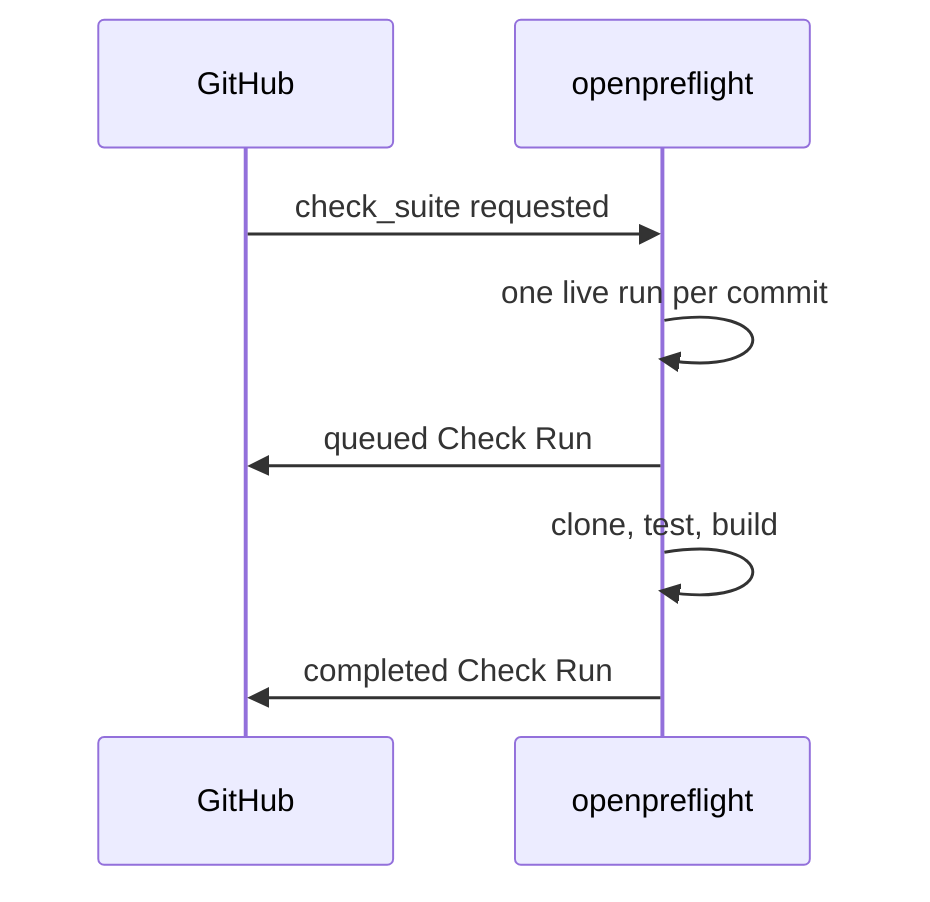

[Part 2](/blog/building-openpreflight-2-one-binary-one-sqlite-file/) was the process. This one is the forge. openpreflight talks to GitHub in a way that's easy to undo if you don't write it down, so I wrote it down after it bit me.

This is part 3 of 5.

## Only a GitHub App can create Check Runs

I keep repeating this because I keep meeting people who want to reuse an OAuth token they already have.

GitHub will refuse. Check Runs are a GitHub App feature. An App also has exactly one webhook URL, which is why Coolify's GitHub connector can't do this job: its webhook belongs to Coolify's deploys, and its manifest has no `checks` permission.

So you register an App you own, with Checks read and write, Contents read-only, Metadata read-only, subscribed to Check suite and Check run. openpreflight is that App's webhook, at `/webhook/{slug}`.

Setup is longer than pasting a personal access token. That's the cost of writing the same commit checks a pull request already shows. [ADR 003](https://docs.openpreflight.xyz/reference/decisions/003-github-app/) is the short version. There's a "Create with GitHub" flow now (GitHub's App manifest), so most people never paste a PEM. Paste stays under Advanced, including for GitHub Enterprise.

Clone credentials are installation tokens from *our* App, passed to git via `GIT_CONFIG_*` as Basic `x-access-token`, then the remote is stripped before any pipeline step runs. The token never enters the remote URL, `.git/config`, or argv. GitHub's git endpoint wants Basic, not the REST API's Bearer. I got that wrong in my head at least once.

## Why not just listen to push?

The worker listens to `check_suite` and `check_run` and nothing else. `push` and `pull_request` fall through to the skip branch. That was never written down, so the most consequential decision in the trigger path was the easiest one to undo. Adding a `push` case looks like a feature. It's actually reversing the model.



A suite is already scoped to one commit and one App, which makes it the natural unit of work. `push` fires for refs no one is reviewing. `pull_request` fires on metadata edits that don't change the tree.

There's prior art. [Zuul](https://zuul-ci.org/) gates on the commit, queues work against an immutable SHA, attaches logs to the run, and reports the result back to the forge. Its architecture doesn't travel: ZooKeeper, Nodepool, Ansible, a scheduler apart from the executors. This project is one Go binary, one SQLite file, one server. I borrowed the semantics and left the rest.

That's [ADR 005](https://docs.openpreflight.xyz/reference/decisions/005-check-suite-gating/). I wrote it because two bugs came out of leaving the invariant unstated.

## Two Check Runs with the same name

The handler used to dedupe on `delivery_id` and cancel on `(repo, ref)`. A commit arriving on a second ref, or a rerequest landing while a job ran, started a second concurrent job. Two Check Runs, same name, same commit. Branch protection then reads whichever finished last.

Quiet failure. The PR looks like it has a check. You're looking at the wrong run.

The rule now is one live run per `(github_app_id, repo, sha)`, enforced in the handler rather than by a database constraint. `CancelJob` cancels the context and returns; the `cancelled` status is written later by the job's own goroutine. A partial unique index over the in-flight statuses would intermittently reject the follow-up insert.

`ev.Action` decides what a second delivery means:

- `requested` is GitHub asking twice. Answer: already queued.
- `rerequested` is a human pressing Re-run. Cancel the run in flight, enqueue a fresh one.

GitHub's Redeliver button reuses the delivery id, so dedup applies only while a job is in flight. Redelivering a finished delivery starts a new job, which is what makes the button useful for debugging.

`check_suite_id` is recorded on the job for traceability. It isn't the key. It can be absent from a payload, and a missing id must not weaken the invariant.

## One Check Run per job

Steps are a table in that run's `output.summary`, not separate Check Runs. One run means one required-status entry in branch protection, so adding a `build` step never breaks the rule.

GitHub renders a Re-run button per check run. A step that can't be re-run alone shouldn't advertise one. The executor still runs steps sequentially in one shell and one workspace. If that ever changes, ADR 005 is the decision to revisit. The recorded suite id is what makes that cheap.

I also rejected a local `check_suites` table. Suites can't be created through the API, and GitHub computes suite status from the runs inside them. A local aggregate would mirror state we don't own, with no reader that needs it.

## A required check has to get an answer

Bindings can list path filters (`frontend/**`, comma or newline). Empty is every path. When the file list for the SHA is complete and nothing matches, the job is skipped (conclusion `skipped`) before clone.

That's not a missing check. Branch protection sits and waits on a check that never arrives. A `skipped` conclusion is an answer.

If GitHub truncates the list (300 files) or the commits API errors, the job still runs and says so. Fail open, and put the decision in the log:

```
Changed files: 18
Matched files: 4
Filter: src/**
Result: RUN
```

One caveat, because I've already tripped on it: the file list is the head commit's, not a pull request's full diff. A filter that looks at "what this PR changes" is a different feature. This one is "what this SHA contains in GitHub's files list."

A cron build, or a manual "build this tag," needs a new decision first. Those have no suite to write to. I haven't added them, and I won't sneak them in through `push`.

[Part 4](/blog/building-openpreflight-4-running-untrusted-code/) is the executor, fork PRs, and the day sibling containers saw an empty `/work`.
