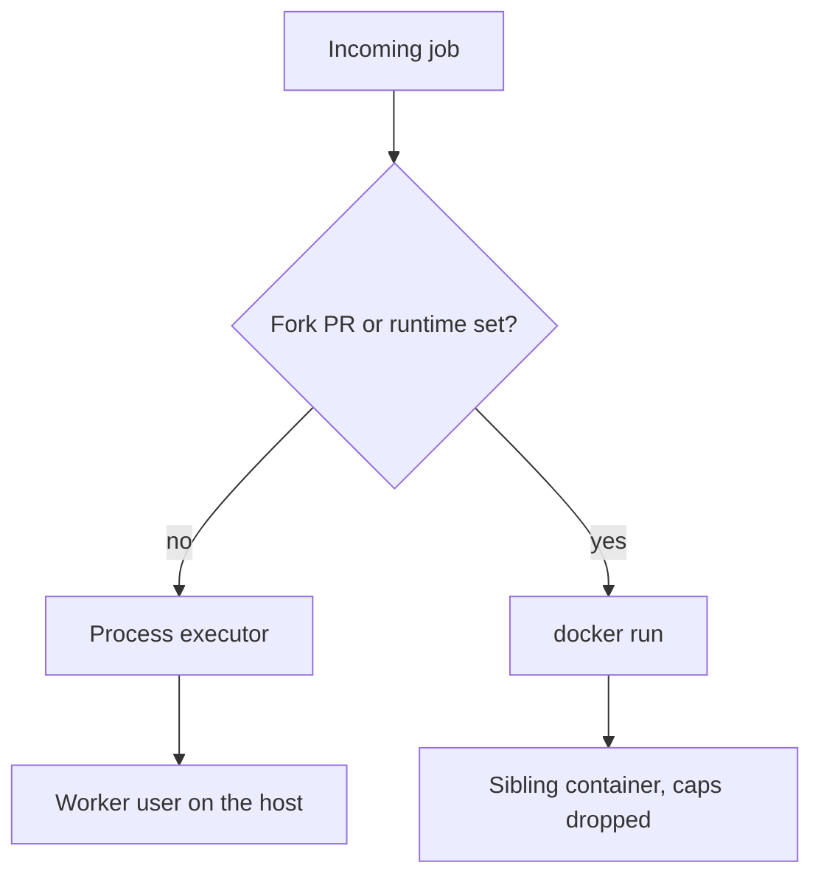

[Part 3](/blog/building-openpreflight-3-gate-on-the-commit/) was how GitHub asks for a run. This one is what happens after the 202.

The pipeline is small on purpose:

```yaml
runtime: node:24
install: npm ci
test: npm test
build: npm run build
timeout: 15m
```

Three steps, in that order. A step that fails stops the run; later steps are reported as skipped. Commands resolve from the repo's `.ci.yml`, then the binding, then a guess from `package.json` / `go.mod` / `Cargo.toml` / `pyproject.toml`. Nothing to run is a skipped check, not a failed one.

This is part 4 of 5. The YAML is easy. The trust boundary is the part I keep thinking about.

## Two executors, and which one you get is a trust decision

The first builds ran every pipeline step as a child of the worker process. `.ci.yml` `runtime:` was parsed and ignored. Fork PRs were always skipped, because they would execute untrusted code with the worker's privileges.

That was honest, and I hit the ceiling immediately. A Node job on a Go worker image is a bad time. A fork PR on a public-ish repo is worse.

[ADR 004](https://docs.openpreflight.xyz/reference/decisions/004-docker-executor/) split it:

| Repository | Executor | Isolation |
| --- | --- | --- |
| Yours, binding enabled | Process, unless `runtime:` is set | The worker's unprivileged user on the host |
| Fork pull request, or any job with `runtime:` | `docker run --rm` | Sibling container, capabilities dropped |



The process executor is the default because for a repository you already control, the code in the checkout is code you were going to run anyway. It isn't a sandbox, and I don't offer it as one.

The Docker executor is what runs code you don't control. Job containers get `--security-opt no-new-privileges`, `--cap-drop ALL`, a non-root user, and no host network. They never receive the Docker engine socket, so a step can't start siblings. Image names are allow-listed before they reach the command line: no shell metacharacters, no leading `-`.

If `runtime:` is set (or the job is a fork) and the engine is unreachable, the job fails outright. There's no silent fallback to the process executor. Silent fallback would be a security bug with a performance excuse.

Coolify's API can list servers and create applications. It cannot start an arbitrary `docker run` on a host. There's no "run this container on server UUID" job API. Remote jobs are whatever Docker already understands: `CI_DOCKER_HOST` / a mounted socket. A Coolify token can't replace that.

Fork isolation is a sibling container with dropped caps, not a sandbox VM. That's the trade-off for staying one process plus `docker run`.

## Fork PRs are skipped, and the skip is a Check Run

A fork pull request is an invitation to run a stranger's code on your server. On a hosted CI provider that risk is someone else's to absorb. Here it's yours, so the default is no.

The skip is reported, not silent. A refused fork still gets a Check Run, completed with `skipped`, whose summary says which setting refused it and what to change. Required checks wait forever on a check that never arrives. I'd rather the PR show "skipped: fork PRs are off" than a hanging yellow dot.

Turning forks on takes two settings, both required:

- `skip_fork_prs` off, so fork jobs queue at all
- `settings.default_runtime` set to the image they run in, because the webhook has no pipeline file yet

A reachable Docker engine is also required. Fork jobs always use Docker, never the process executor, and that isn't configurable.

## The job must not see the worker's life

Job environments are built from scratch. No `CI_SECRET_KEY`, no PEMs, no webhook secrets, no Coolify tokens, no installation token. `PATH`, `HOME`, `TMPDIR`, and `npm_config_cache` are stripped so a pipeline can't redirect the container's own toolchain.

The clone credential is an installation token, passed through `GIT_CONFIG_*`, then the remote is removed before any step runs. I mentioned that in part 3. It belongs here too, because the failure mode is a build script that does `git remote -v` and prints a token into the log you were about to share.

HMAC is verified against that App's webhook secret before anything else happens. An unsigned body is rejected without touching the queue. A correctly signed delivery for a repository with no enabled binding is dropped. The bindings table is an allow-list, not a courtesy.

Shareable log links are unguessable UUIDs. Treat them as secrets anyway. GitHub never fetches `details_url`. The reader's browser does.

## The empty `/work` bug

`runtime:` jobs using the host `docker.sock` used to mount the checkout from `WORKSPACE_DIR` as the container saw it. Sibling containers got an empty `/work`. The path that matters to `docker run -v` is the host path behind the mount.

The worker now reads `/proc/self/mountinfo` (or `CI_WORKSPACE_HOST` if you've done something I can't see). That's the kind of bug you only find by actually running `runtime:` jobs from inside a Compose service, which is how I run ci.openpreflight.xyz.

`DOCKER_GID` is the other footgun. The worker runs as uid 10001. It needs the socket's group as the container sees it: `0` on Docker Desktop, usually `998` or `999` on Linux. Read it with `docker compose exec openpreflight stat -c %g /var/run/docker.sock`. Nothing else requires it. I've now typed that sentence into the docs more times than I typed the original bug.

## What a run looks like from the webhook

1. `POST /webhook/{slug}` must return 2xx within GitHub's ~10s window. HMAC, binding, branch, fork policy, then 202.
2. The runner mints an installation token, opens a Check Run, fetches that commit (fork PRs fall back to `refs/pull/N/head`), detaches, strips the remote.
3. Steps run as a process, or `docker run` when `runtime:` is set. Timeout is real.
4. The Check Run is completed. The full log stays on the details page. GitHub gets a truncated tail in the summary.

The run page tails an in-flight log over SSE (`GET /api/v1/jobs/{id}/logs/stream`). If a reverse proxy swallows events, disable buffering on that path. I lost a few hours to that on Coolify's proxy before I wrote it down.

[Part 5](/blog/building-openpreflight-5-the-project-that-checks-itself/) is shipping it, making it check itself, and the things I still will not add.
