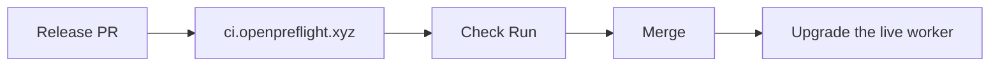

[Part 4](/blog/building-openpreflight-4-running-untrusted-code/) was the executor. I'm more interested in what the tool still refuses to do than in the version numbers.

This is part 5 of 5.

## The name was lying

I'm not going to pretend this was a careful architecture program. I made the smallest thing that could write a Check Run, then refused the features that would have turned it into a worse Woodpecker.

The first repo was still called `coolify-github-ci`. The rename still amuses me. The data plane had no Coolify coupling (`internal/coolify` is inventory and a repo picker), so the module path, binary name, Compose service, and User-Agent could all move. The `CI_*` env prefix and the `ci-data` / `ci-workspace` volume names deliberately did not. Renaming those would have broken every existing deployment for no benefit. The default Check Run name also stayed put on existing databases. GitHub matches a required status check by name string. Rewrite a live install's and branch protection waits for a check that never reports again.

Docs and the two sites are their own repositories. The license is Apache-2.0.

## The dogfood test that actually counted

The docs claimed the project checks itself. That's now true: docs, website, and the binary each get a Check Run from [ci.openpreflight.xyz](https://ci.openpreflight.xyz). GitHub Actions stayed for `release.yml` on a `v*` tag, because publishing multi-arch images is not something this tool does.

The claim got a harder test when the running worker wrote the passing Check Run on the three PRs that shipped the next release. I upgraded the live box after they merged: backup `ci.db` plus WAL plus SHM together, pull the image, patch the Coolify compose, restart. Healthy in eight seconds. Migrations applied on boot.



Until a CI provider can check its own release PRs, it's a demo. That upgrade is when it stopped being one.

`.ci.yml` for the Go repo is `go vet ./...` and `go test ./...`. Tests need no network and no credentials: Coolify and GitHub are faked, and clone/pipeline tests run against a real `git-http-backend` over a fixture repository. I care about that more than I care about coverage percentages. If the test suite needs a GitHub token, I will not run it on the thing that is supposed to be the GitHub token.

## The operator UI was the long tail

The first UI was `html/template`. It worked. It also looked like a tool I'd apologize for. It now uses [templ](https://templ.guide/) and copied [shadcn-templ](https://shadcn-templ.com) components on Tailwind v4. A lot of the later work was making the operator chrome something I'm willing to live in.

A few things I'd do again:

- Flash banners ate a row of every page for a sentence that belongs in the corner. They're toasts now. A success dismisses itself; an error stays.
- The run log is a dark Check Run panel in light or dark chrome. That's the screen people actually look at. I stopped putting fake dashboards on the marketing site for the same reason.
- Cancelling a run used to be a single click. In a dense table the neighbouring row is a different build. The dialog now names the repository and the commit.

A few things I deleted:

- The Lucide set shipped 1,702 icon definitions for the 29 the pages render. `icon_data.go` went from 6,773 lines to 94. The `linux/amd64` binary went from 20.3 MB to 16.9 MB. The per-icon SVG cache (a map and a mutex memoising one `Sprintf`) went with it.
- `aspectratio` and `dropdownmenu`, which no page imported. Roughly 25 KB of JavaScript off every page load.
- Three copies of a getenv-with-default helper, now `cmp.Or`. Two copies of the pass/fail/skip marks that each commented "must match the other," now on `executor.Result` where both callers already look.

Job logs used to keep the ANSI. Build tools colour their output whether or not a terminal is attached, and none of the four readers interpret escape codes, so a coloured line arrived as `[42m[30m generating static routes [39m[49m`. That's garbage in a log file. Escape sequences are stripped as they are written.

## What I still will not add

I keep a comparison page that tells you when to pick something else. I mean it.

- No Actions YAML, no runner registration, no marketplace.
- No matrices, caches, or artifacts. A fresh shallow clone every time.
- No agent protocol. One machine.
- No teams, no SSO, no GitHub OAuth on the UI. One admin.
- GitHub only, because it's built on Check Runs and no other forge has them.

Woodpecker is the closest comparison and, for most people, the better default. Jenkins if you need a plugin that already exists. Self-hosted `actions/runner` if you already have `.github/workflows/` you want to keep. openpreflight if you want a check on the commit, on a box you already run, with as little to operate as possible.

The ceiling is real. I'd rather ship a small tool that's honest about that than a medium one that's "almost Woodpecker" and worse at it.

## If you want to try it

Site: [openpreflight.xyz](https://openpreflight.xyz). Docs: [docs.openpreflight.xyz](https://docs.openpreflight.xyz). Source: [github.com/openpreflight/openpreflight](https://github.com/openpreflight/openpreflight). Current release is [v2.2.0](https://github.com/openpreflight/openpreflight/releases/tag/v2.2.0). Apache-2.0.

```bash
curl -O https://raw.githubusercontent.com/openpreflight/openpreflight/main/compose.prod.yaml
export CI_SECRET_KEY="$(openssl rand -base64 48)"   # keep it forever
docker compose -f compose.prod.yaml up -d
```

The ADRs are in the docs, under [Decisions](https://docs.openpreflight.xyz/reference/decisions/001-database/). If you read only one, read [005](https://docs.openpreflight.xyz/reference/decisions/005-check-suite-gating/). The trigger model is most of the product.
